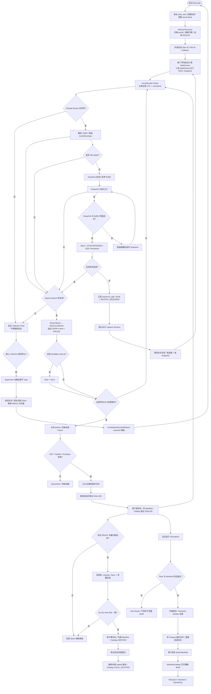

# Binance Market Data Recorder

> **Mac Developer Preview / Ubuntu ARM64 Soak Candidate — `0.1.0a1`**
>
> **M21.4 USD-M Backpressure 修复已通过 PR #7 合并并部署到生产环境。**
> 正式 2 小时和 12 小时**进程稳定性**验收通过并完成独立证据复核。
> 正式 24 小时**进程稳定性**验收通过，并完成纠错复核和 Backpressure 合同法证确认；
> 正式窗口内 gen5 自然 Backpressure 恢复合同 PASS。
> **正式 72 小时验收 FAIL（数据完整性合同失败）**：2026-08-07T14:08:24Z
> USD-M book_ticker 意外断线及所有 planned rotation 边界均无 gap 证据
> （gap=false/complete=true）。12h/24h 数据完整性验收被
> SUPERSEDED_BY_RECONNECT_INTEGRITY_FINDING 取代。
> M21.4.11 修复已实现并提交 PR 审查，**未部署**。168 小时验收未开始。
>
> **本项目为独立、非官方项目。与 Binance 不存在隶属、维护、赞助、背书或合作
> 关系。** 项目名称仅标识其连接的公开数据源和 API。本项目不使用 Binance
> 商标、Logo 或官方视觉识别。
>
> Binance Market Data Recorder is an independent, unofficial project.
> It is not affiliated with, maintained by, sponsored by, or endorsed by Binance.
> This project does not use Binance logos or official visual identity.
>
> M21.4 (USD-M Backpressure repair) was merged through PR #7 and deployed to
> production. Formal 2-hour and 12-hour process-stability validations passed
> with independent evidence reviews. The formal 24-hour process-stability
> validation passed and was confirmed by a corrective evidence review and a
> Backpressure contract forensic review; the natural gen5 backpressure
> recovery cycle inside the formal window passed its recovery contract.
> **The formal 72-hour validation FAILED on data integrity**: the
> 2026-08-07T14:08:24Z USD-M book_ticker unexpected disconnect and every
> planned rotation sealed their reconnect boundaries without gap evidence.
> The M21.4.11 reconnect-boundary repair is implemented and under review;
> it is NOT deployed. The 168-hour validation has not started.
>
> 本项目只采集 Binance 公共市场数据。它**没有** API Key 配置、账户接口、
> 订单提交、策略引擎、回测框架或交易能力。它不是一个交易机器人。

连续72小时和168小时长期运行验收尚未执行。
静态审查、单元测试、故障注入和短期在线测试不能替代长期运行证明。
当前版本为Mac Developer Preview;Ubuntu ARM64/RK3588为Developer Preview / Soak Candidate;不得用于真实资金交易。

**72小时窗口验收结果为 FAIL（数据完整性合同失败）**：详见下文与
`docs/milestone_evidence/M21.4-72h-failure-and-reconnect-integrity.md`。
修复已实现并提交 PR 审查，未部署。

M21.4 USD-M Backpressure修复已合并和部署，正式2h、12h和24h进程稳定性验收通过。
正式24h结果经纠错复核和Backpressure合同法证确认；正式窗口内gen5自然
Backpressure恢复合同PASS。**正式72h验收FAIL（数据完整性）**：所有普通
reconnect/planned rotation 边界均无 gap 证据。M21.4.11 修复已实现，未部署。
不代表 Production Ready。

Binance Market Data Recorder 是 specifically for Binance public market data
的本地录制、完整性验证、
归档、规范化和确定性重放系统。它从 Binance 公开 WebSocket 和 REST 端点采集
原始字节，持久化为不可变 Raw 数据，再派生为版本化 Parquet 数据集，供外部研究、
回测、监控和模拟项目消费。

macOS Apple Silicon 保持 **logged-in-user LaunchAgent** 支持；Ubuntu
ARM64/RK3588 增加非 root **systemd** 部署，平台状态为 Soak Candidate，
尚未完成 72h/168h 认证。Windows 尚未实现。V1 仅支持 BTCUSDT Spot 和
BTCUSDT USD-M 永续合约。支持其它交易所需要单独的架构审查
(another exchange requires a separate architecture review)。

## 目录

- [安全声明](#安全声明)
- [当前实现状态](#当前实现状态)
- [已实现功能总览](#已实现功能总览)
- [数据覆盖矩阵](#数据覆盖矩阵)
- [系统架构](#系统架构)
- [实时采集与订单簿流程](#实时采集与订单簿流程)
- [Raw 数据平面和完整性保证](#raw-数据平面和完整性保证)
- [Catalog 和状态平面](#catalog-和状态平面)
- [外置存储和归档](#外置存储和归档)
- [Normalized Parquet](#normalized-parquet)
- [Replay 和 Consumer 能力](#replay-和-consumer-能力)
- [Historical Backfill](#historical-backfill)
- [Metrics、报告与容量管理](#metrics报告与容量管理)
- [服务运行、故障隔离与 Blue/Green](#服务运行故障隔离与-bluegreen)
- [CLI 完整参考](#cli-完整参考)
- [配置](#配置)
- [安装和快速开始](#安装和快速开始)
- [数据目录](#数据目录)
- [技术栈](#技术栈)
- [测试和验证](#测试和验证)
- [已知限制和非目标](#已知限制和非目标)
- [典型使用路径](#典型使用路径)
- [Consumer 和研究项目边界](#consumer-和研究项目边界)
- [文档导航](#文档导航)
- [授权和免责声明](#授权和免责声明)

## 安全声明

> **严重警告**
>
> - 本项目是 **Mac Developer Preview / Ubuntu ARM64 Soak Candidate**（`0.1.0a1`）。
> - **72 小时和 168 小时长期运行验收尚未执行。**
>   静态审查、单元测试、故障注入和短期在线测试不能替代长期运行证明。
> - **不得用于真实资金交易。**
> - 本项目**不包含 API Key、账户、订单或交易能力**。
> - 本项目**与 Binance 无任何隶属、维护、赞助或背书关系**。
> - macOS Apple Silicon 为 Developer Preview；Ubuntu ARM64/RK3588 为
>   Developer Preview / Soak Candidate；Windows 尚未实现。

## 当前实现状态

| 属性 | 值 |
|------|-----|
| Distribution | `binance-market-data-recorder` |
| Import package | `binance_market_data_recorder` |
| CLI | `binance-market-recorder` |
| 版本 | `0.1.0a1` |
| Python | 3.12 (`>=3.12,<3.13`) |
| 平台 | macOS Apple Silicon Developer Preview; Ubuntu ARM64/RK3588 Soak Candidate |
| 部署方式 | logged-in-user LaunchAgent / non-root systemd |
| 默认 data root | macOS Application Support; Linux XDG（systemd 用 `/var/lib/...`） |
| Symbol | BTCUSDT |
| Market | Spot + USD-M Perpetual |
| 长期验证 | 2h PASS（短窗口进程稳定性）；12h/24h 进程稳定性 PASS（数据完整性被 reconnect 发现取代）；**72h FAIL**；168h 未开始 |
| PR/部署 | PR #7 已合并 (Merge Commit cf1e749c...), 生产 Wheel 已部署；M21.4.11 修复 PR 待审查，未部署 |

CLI `--version` 显示版本号和 Git commit 用于参考。注意 Git 后缀可能受构建工作目录或
检出分支影响；生产安装的 Artifact 身份必须以不可变 Wheel SHA-256、direct_url.json、
安装位置和 Canonical Installed Identity Gate 为准，不能仅凭 CLI 输出或仓库 HEAD
确定。详见 `docs/milestone_evidence/M21.4-deployment-and-validation.md`。

## 已实现功能总览

| 子系统 | 实现状态 | 触发方式 | 输出 | 主要限制 |
|--------|---------|---------|------|---------|
| Spot 实时采集 | 已实现 | Collector 启动后自动 | Raw chunks (.bmdr.zst) | 仅 BTCUSDT |
| USD-M 实时采集 | 已实现 | Collector 启动后自动 | Raw chunks (.bmdr.zst) | 仅 BTCUSDT perpetual |
| USD-M 辅助 WebSocket | 已实现 | 默认启用 | Raw chunks | mark price, liquidation |
| USD-M 辅助 REST 轮询 | 已实现 | 默认启用 | Raw chunks | premium index, funding, OI, exchange info |
| USD-M 5 分钟统计 | 已实现 | 默认全部启用 | Raw + normalized | 受官方保留窗口约束 |
| Spot exchangeInfo | 已实现 | 默认启用 (每小时) | Raw + normalized | 仅 BTCUSDT |
| 本地订单簿重建 | 已实现 | Collector 内部自动 | Checkpoints | R-034 Open, Spot U/u, USD-M U/u/pu |
| Depth Resync | 已实现 | 序列断连时自动触发 | Gap 证据, RESYNC_REQUIRED | Spot/USD-M 各自隔离 |
| Raw Spool | 已实现 | Collector 回调自动 | .partial → .bmdr.zst | CBOR + CRC32C |
| 崩溃恢复 | 已实现 | 启动时自动 | 截断/恢复/seal | 尾部最后帧可能丢失 |
| Manifest + Catalog | 已实现 | 自动 | SQLite + JSON manifests | 仅元数据，不存事件体 |
| Metrics + 日报 | 已实现 | UTC 日边界自动聚合 | JSON + CSV | UTC 日边界 |
| 存储容量预测 | 已实现 | `storage forecast` CLI | JSON | 需要历史样本 |
| 外置存储注册 | 已实现 | `storage register` CLI | 注册探针 + READY 状态 | 不格式化/修复磁盘 |
| 安全弹出 | 已实现 | `storage eject` CLI | SAFE_TO_REMOVE | 非强制 unmount/eject |
| 归档事务 | 已实现 | `archive retry` CLI | 外部副本 + manifest | 需 READY 目标 |
| Normalization | 已实现 | `normalize run` CLI | Parquet + Build Manifest | 不是持续后台 |
| Replay | 已实现 | 只读 Consumer Python API | 确定性事件流 | 无网络 API |
| Historical Backfill | 已实现 | `backfill plan/run` CLI | Parquet (archive clock) | 无 L2, 无 receive clock |
| launchd 服务 | 已实现 | `launchd install` CLI | LaunchAgent plist | logged-in user only |
| systemd 服务 | M20 已实现 | `systemd install` CLI | system unit + journald | Ubuntu ARM64 Soak Candidate |
| 统一代理策略 | M20 已实现 | TOML / environment | direct/environment/explicit | 显式 URL 不进入状态或数据 |
| Blue/Green 切换 | 已实现 | make-before-break | 重叠 Raw + Catalog 审计 | 长期重复轮换未验证 |
| CLI 诊断 | 已实现 | `doctor/status/config` | JSON | 离线 |

## 数据覆盖矩阵

### Spot BTCUSDT

| 数据流 | Live | Historical | 时钟 | 备注 |
|--------|------|------------|------|------|
| diff depth 100ms | Raw + replay | 不可用 | exchange + receive | L2 重建; 缺口显式标记 |
| aggTrade | Raw + replay | microstructure-trades | exchange + receive live; archive source historical | trade bars |
| bookTicker | Raw + replay | 不可用 | exchange + receive | top-of-book; 无 Historical archive |
| REST depth snapshot | Raw | 不可用 | receive | L2 bootstrap |
| exchangeInfo | Raw + normalized | 不可用 | receive + serverTime | 每小时轮询, 可配置 |
| klines 1m | 未实现 Live 流 | baseline-bars | archive source | 基准 bars |
| raw trades | 未实现 Live 流 | microstructure-trades | archive source | 逐笔交易 |

### USD-M BTCUSDT Perpetual

| 数据流 | Live | Historical | 时钟 | 备注 |
|--------|------|------------|------|------|
| diff depth 100ms | Raw + replay, U/u/pu | 不可用 | exchange + receive | L2 重建 |
| aggTrade | Raw + replay | microstructure-trades | exchange + receive live; archive source historical | trade bars |
| bookTicker | Raw + replay | 不可用 | exchange + receive | top-of-book |
| REST depth snapshot | Raw | 不可用 | receive | L2 bootstrap |
| mark price | Raw WebSocket | markPriceKlines 1m | exchange + receive | 1s 推送 |
| liquidation | Raw WebSocket | 不可用 | exchange + receive | 稀疏事件流; 非完整清算账本 |
| premium index | Raw REST | premiumIndexKlines 1m | receive | 轮询 |
| funding history | Raw REST | fundingRate (monthly) | receive | 轮询 |
| funding info | Raw REST | 不可用 | receive | 稀疏调整记录 |
| open interest | Raw REST | 不可用 | receive | 轮询 |
| exchange info | Raw REST | 不可用 | receive | 轮询 |
| index price klines | 不可用 | indexPriceKlines 1m | archive source | baseline-bars |
| klines 1m | 未实现 Live 流 | baseline-bars | archive source | 基准 bars |
| raw trades | 未实现 Live 流 | microstructure-trades | archive source | 逐笔交易 |

### USD-M 六种 5 分钟统计

默认全部启用，每个具有独立 Durable Cursor。受官方 latest month / latest 30-day
保留窗口约束。

| 统计名称 | 配置项 | 默认轮询间隔 | 语义 |
|---------|--------|-------------|------|
| Open Interest Statistics | `side_open_interest_statistics_enabled` | 300s | 持仓统计 |
| Taker Buy/Sell Volume | `side_taker_buy_sell_volume_enabled` | 300s | 主动买卖量 |
| Global Long/Short Ratio | `side_global_long_short_ratio_enabled` | 300s | 全局多空比 |
| Top Long/Short Account Ratio | `side_top_long_short_account_ratio_enabled` | 300s | 大户多空比 |
| Top Long/Short Position Ratio | `side_top_long_short_position_ratio_enabled` | 300s | 大户持仓比 |
| Basis | `side_basis_enabled` | 300s | 基差 |

### 重要约束

- **Historical 没有本地 receive clock**。Historical 行标记为
  `clock_semantics=archive_source`。
- **Historical 和 Live 不会自动拼接**。receive-time replay 拒绝
  archive-only 行。
- **缺失值为 ABSENT/GAP**，从不填零或 forward-fill。
- **bookTicker 没有 Historical archive**。
- **liquidation 是稀疏事件流**，静默不代表零事件。
- **L3 队列位置不可用**。公共 L2 不提供。
- 六种 5 分钟统计受官方保留窗口约束，超出窗口的缺口不可恢复，会显式记录 Gap。
- Live raw trades 和 Live klines 流尚未实现。
- USD-M `pu` 实时连续性要求 `next.pu == current_local_book.update_id`。
- R-034 仍为 Open：官方 Spot bootstrap 文辞与 toolbox 示例冲突，代码使用
  `lastUpdateId + 1`。

## 系统架构

```mermaid
flowchart LR
    subgraph Sources["数据源"]
        BS["Binance Spot<br/>3 WebSocket + REST Snapshot"]
        BU["Binance USD-M<br/>3 WebSocket + REST Snapshot + Side Data"]
        HV["data.binance.vision<br/>Historical ZIP + CHECKSUM"]
    end

    subgraph Runtime["运行监督"]
        CLI["CLI"]
        SERVICE["launchd Service<br/>flock / heartbeat / SIGTERM"]
        SUP["MarketCollectorSupervisor<br/>核心终止时 fail-closed"]
        CLI --> SERVICE --> SUP
    end

    subgraph Capture["实时采集"]
        SPOT["SpotCollector"]
        USDM["UsdMCollector"]
        SIDE["SideDataSupervisor<br/>独立重启"]
        READY["CollectorReadiness"]
        RESYNC["DepthResyncCoordinator<br/>Spot/USD-M 隔离"]
        BOOK["LocalBookReconstructor<br/>Spot U/u / USD-M U/u/pu"]
    end

    BS --> SPOT
    BU --> USDM
    SUP --> SPOT
    SUP --> USDM
    USDM --> SIDE
    SPOT <--> READY
    USDM <--> READY
    READY <--> BOOK
    BOOK --> RESYNC
    RESYNC --> SPOT
    RESYNC --> USDM

    subgraph RawPlane["Raw 与状态平面"]
        RQ["有界 Receipt Queue"]
        ENV["EventEnvelope v1<br/>原始字节 + UTC/Monotonic"]
        IQ["有界 Ingress Queue"]
        SPOOL["StreamSpool"]
        WRITER["RawChunkWriter<br/>CBOR + CRC32C + fsync"]
        ACTIVE["active/*.partial"]
        SEAL["Seal / Startup Recovery<br/>扫描 / SHA-256 / Zstd / 原子提交"]
        SEALED["sealed/*.bmdr.zst"]
        CAT[("Catalog SQLite<br/>状态/事务/聚合")]
        CP["Order-book Checkpoints"]
        REPORT["Daily JSON/CSV"]
    end

    SPOT --> RQ
    USDM --> RQ
    SIDE --> RQ
    RQ --> ENV --> IQ --> SPOOL --> WRITER --> ACTIVE --> SEAL --> SEALED
    SPOOL --> CAT
    SEAL --> CAT
    BOOK --> CP --> CAT
    SPOT --> REPORT
    USDM --> REPORT
    REPORT --> CAT

    subgraph Archive["外置归档"]
        REG["Registered Folder<br/>Volume UUID + Marker + Probe"]
        AM["ArchiveManager<br/>Copy / fsync / Readback / Verify"]
        EXT["外部 Raw + External Manifest"]
        DEL["LOCAL_DELETED"]
    end

    REG --> AM
    SEALED --> AM
    CAT <--> AM
    AM --> EXT
    EXT --> DEL

    subgraph Derived["派生与消费"]
        NORM["Normalizer<br/>验证 / 排序 / 去重 / 冲突保留"]
        PQ["Content-addressed Parquet<br/>market/stream/date/hour"]
        REPLAY["ManifestCatalog + Replay<br/>Receive/Exchange Clock / GapPolicy"]
        CONSUMER["Research / Backtest / Monitoring"]
        HIST["HistoricalImporter<br/>独立 Archive Clock"]
    end

    SEALED --> NORM
    CP --> NORM
    NORM --> PQ --> REPLAY --> CONSUMER
    HV --> HIST --> CONSUMER
    HIST -. "不会自动与 Live 拼接" .-> PQ
```



**关键隔离边界：**

- Side-data 失败**不停止**核心 L2。
- 任一核心 Collector 终止 → `MarketCollectorSupervisor` 停止全部子任务 →
  `CoreMarketTerminalFailure` → launchd 重启整个进程。
- Spot 和 USD-M 的 Depth Resync 相互隔离。
- Normalization **不在** Collector 回调或核心 capture 路径执行。
- Historical 与 Live 不会自动合并。

## 实时采集与订单簿流程



### 桥接规则

**Spot：** `U <= snapshot.last_update_id + 1 <= u`

**USD-M 初始桥接：** `U <= snapshot.last_update_id <= u`

**USD-M 实时连续性：** `next.pu == current_local_book.update_id`

Gap 触发 `RESYNC_REQUIRED`，offending update 保留为 `_buffer` 首项，
非同步期间后续事件继续进入有界缓冲。`restart_bootstrap` 清除派生状态 →
停止当前 capture session → 带 jitter 退避 → 新连接 + 新 Snapshot →
重新桥接。

### Reconnect Boundary 完整性（M21.4.11）

任意 transport 边界（unexpected disconnect / planned rotation / server
shutdown / session restart / backpressure）都会：

1. drain 并 seal 旧 generation（无可用未持久化 boundary frame 时，manifest
   级 `reconnect_gap` 强制 `gap=true`/`complete=false`；Raw 帧绝不改写）；
2. 先持久化 Catalog `STREAM_DISCONTINUITY_STARTED`，再 `generation++`；
3. 打开新连接；首个新帧携带 `sequence_gap`；
4. Raw sync 之后才提交 `STREAM_DISCONTINUITY_COMPLETED`；
   `historical_continuity_restored=false`。

close 与首个新帧之间的 exchange-side completeness 永远无法证明，
planned rotation 不是豁免。diff_depth 永远不流内重连：边界即会话退休，
必须先 fresh Snapshot + 正确桥接才能 READY。详情：
`docs/milestone_evidence/M21.4-72h-failure-and-reconnect-integrity.md`。

R-034 仍为 Open：官方 Global Spot bootstrap 文辞与官方 toolbox 示例冲突。
代码使用 `lastUpdateId + 1` 规则，不作官方纠正声明。

## Raw 数据平面和完整性保证

### EventEnvelope v1

每个事件记录 `schema_version=event-envelope.v1`，包含：

- 精确原始 WebSocket 负载字节 (`raw_payload`)
- `receive_time_utc_ns`：UTC 接收挂钟时间
- `receive_monotonic_ns`：进程内单调接收时间
- `exchange_event_time` / `exchange_transaction_time` / `exchange_trade_time`
- `venue=binance`, `market` (spot / um_perpetual), `symbol=BTCUSDT`, `stream`
- `connection_id`, `collector_instance_id`, `collector_version`
- `source_sequence`：流特定序列 ID (U/u/pu 等)
- `capture_flags`：planned rotation, overlap, server_shutdown 等

### Raw Chunk 格式

- **Canonical CBOR** 编码，length-prefixed frame
- 每帧独立 **CRC32C** (Castagnoli)
- 版本化 chunk header
- 活跃文件后缀 `.partial`
- 定期 flush/fsync（最大 1 秒 durability interval）
- 时间（60 秒）或大小（128 MiB）轮换，先到先触发
- **不**在 active 状态直接压缩

### Seal 步骤

1. 扫描所有 frame，验证 CRC32C，计算统计和 uncompressed SHA-256
2. **Zstd level 3** 压缩到 `sealed/<chunk_id>.bmdr.zst.partial`
3. **解压回读**，验证与原始 uncompressed SHA-256 一致
4. **原子 rename**，fsync 目录
5. 写入 **manifest JSON**（统计、双重哈希、complete 标志）
6. Catalog 提交 **SEALED**。仅此后才删除 `.partial` 源

### 崩溃恢复

- 每帧独立 CRC32C，尾部截断到最后一个有效帧 (`ftruncate`)
- 标记 `RECOVERED`，记录精确移除字节数
- SEALING 状态中崩溃 → 重新执行 `seal_partial()`
- 已写 manifest 但未提交 Catalog → `reconcile_sealed()` 恢复
- 不可恢复文件 → Quarantine（保留证据，不自动处理）
- Raw 不可变：Derived 输出不能改写 Raw

## Catalog 和状态平面

SQLite Catalog (`state/catalog.sqlite`) 是**所有状态转换和元数据的唯一经久化点**。

**实际保存：**
- Chunk 状态（ACTIVE → ... → LOCAL_DELETED）
- Archive transaction 记录
- Storage registration（UUID, marker, relative path, storage_id）
- Order-book checkpoint metadata
- Blue/Green deployment 审计
- Side-data Durable Cursor
- Metrics 聚合批次
- Operational events
- 容量样本和存储告警

**不保存：**
- Raw payload 字节
- 逐条市场事件
- 价格、数量语料
- Parquet 主体

**事务保证：**
- 所有写入使用 `BEGIN IMMEDIATE` + `RLock` 串行化
- WAL 模式 + `synchronous=FULL`
- 幂等状态转换（idempotency keys）
- 单进程写入边界由 kernel `flock` 保证
- WAL 不能修复任意 SQLite 文件损坏

## 外置存储和归档

### 注册

- 注册的是**现有文件夹**，不是整个磁盘
- 身份由 Volume UUID + marker + relative path + storage_id 确定
- 注册时执行 write/fsync/rename/readback **探针**
- Recorder **不会**格式化、修复或重新挂载磁盘
- 挂载点按 UUID 重新解析，不依赖固定 `/Volumes/<name>`

### 归档事务

1. 保留最旧的 SEALED chunk
2. 流式复制到外部 `.copying` 临时文件
3. fsync + 完整 readback + SHA-256 验证
4. 原子 rename 为最终不可变文件名
5. 提交外部 manifest（嵌入 Raw manifest base64）
6. Catalog 提交 VERIFIED
7. 单独授权内部源删除 → `LOCAL_DELETE_PENDING`
8. **再次验证**外部提交 → `LOCAL_DELETED`

```
SEALED → ARCHIVE_COPYING → ARCHIVE_VERIFYING → ARCHIVED_VERIFIED
→ LOCAL_DELETE_PENDING → LOCAL_DELETED
```

每个步骤都是幂等和可重试的。外部介质消失 → `DISAPPEARED_DURING_COPY`，
保留内部源。`LOCAL_DELETED` 后外部文件**可能是唯一副本**，归档不是独立备份策略。

### 安全弹出

- 立即请求与 archive reservation 互斥
- 非终结状态 archive 返回 `BUSY`
- Recorder fsync 外部目录和 Catalog
- 请求非强制 Disk Arbitration unmount → eject
- 只有两个回调都成功才 `SAFE_TO_REMOVE`
- 永不强制 unmount，永不格式化或修复
- Linux M20 仅发现用户已挂载目录；没有可靠 eject backend 时返回
  `MANUAL_ACTION_REQUIRED`，不伪造 `SAFE_TO_REMOVE`

## Normalized Parquet

Normalization 是**显式 CLI 触发**的派生过程，不在 Collector 或 capture 路径执行。

### 流程

1. 验证所有输入 Raw（stored/decompressed SHA-256）
2. content-addressed、确定性外部排序
3. 固定 **10,000 行**批次
4. **semantic identity** 去重（相同 identity + 相同 content → 选择最小 provenance 元组）
5. **identity conflict** 保留（相同 identity + 不同 content → 全部保留，标记 `identity_conflict=true`）
6. malformed evidence 保留为 `valid=false` 行
7. Gap/Resync/Recovered flags 传播到行和 partition manifest
8. `market/stream/date/hour` 分区
9. PyArrow Parquet + Zstandard 压缩
10. schema metadata 嵌入所有版本
11. 逻辑回读 hash 验证
12. 原子发布 Build Manifest
13. 绑定经验证 M6 Checkpoint
14. Normalization lock 防止并发
15. 失败时**不发布**半成品 Build

Normalizer **不会**自动随 Collector 持续运行。

## Replay 和 Consumer 能力

### 合约版本

- `consumer-contract.v1`：公开类型和行为
- `normalized-dataset.v1`：不可变 normalized build
- `replay-order.v1`：时钟和全序语义

### 使用方式

```python
from binance_market_data_recorder.replay import (
    GapPolicy, ManifestCatalog, MissingExchangeTimePolicy,
    ReplayClock, ReplayQuery,
)

catalog = ManifestCatalog(data_root)
dataset = catalog.open_build(EXPLICIT_BUILD_ID)

query = ReplayQuery(
    clock=ReplayClock.RECEIVE_TIME,
    markets=("spot",),
    streams=("agg_trade",),
    gap_policy=GapPolicy.ERROR,
)

for event in dataset.replay(query):
    ...
```

### 关键特性

- **显式选择一个 Build**，没有隐式 "latest"
- 打开时验证所有 path/hash/checkpoint 身份
- `ReplayClock.RECEIVE_TIME` 或 `ReplayClock.EXCHANGE_TIME`
- `MissingExchangeTimePolicy`：ERROR / EXCLUDE / FALLBACK_RECEIVE
- `GapPolicy`：ERROR / INCLUDE / EXCLUDE
- 固定 10,000 行批次 + 32-way bounded external merge
- 确定性 tie-break
- Checkpoint seek（仅 single-market/symbol diff_depth）
- **只读**：不修改 Raw、Parquet、manifest、Catalog

### 当前存在

- Python 只读 Replay API
- `examples/replay_consumer.py`：独立消费示例
- ManifestCatalog + BuildSummary + PartitionDescriptor
- `py.typed` 供静态类型检查

### 当前不存在

- HTTP REST 服务
- gRPC 服务
- 对外 WebSocket 服务
- 远程查询服务器
- 多用户 API Gateway

## Historical Backfill

### 来源

官方 `data.binance.vision`，HTTPS，无 API Key。

### Profile

**baseline-bars（默认）：**
- Spot klines 1m
- USD-M klines 1m
- USD-M markPriceKlines 1m
- USD-M indexPriceKlines 1m
- USD-M premiumIndexKlines 1m
- USD-M fundingRate (monthly only)

**microstructure-trades：**
- Spot trades
- Spot aggTrades
- USD-M trades
- USD-M aggTrades

### 流程

- `plan`：生成下载计划（ZIP + .CHECKSUM URL，estimated bytes）
- `run`：执行下载和导入
  - 月度/日度粒度自动选择
  - SHA-256 校验
  - `.partial` 标记下载中
  - HTTP Range Resume (206 Content-Range 校验)
  - 200 全量回退，416 处理
  - URL+Checksum Revision + `supersedes`
  - 404 Gap
  - 50,000 行流式批次 CSV → Parquet
- `status`：查看导入状态
- `verify`：验证所有已导入 source revision

### 时钟和约束

- `clock_semantics=archive_source`
- 毫秒/微秒时间戳转换（Spot 2025-01-01 起为 microseconds）
- Historical 与 Live 分离，不自动拼接
- 无 Historical L2
- 无 Historical bookTicker

## Metrics、报告与容量管理

### Metrics 架构

- Counter / Gauge / Histogram
- 当前 RSS / Peak RSS
- Queue Depth / Event counts
- malformed / gap / resync counts
- connection lifecycle events
- latency / operation timing
- Raw bytes / sealed bytes / archived-deleted bytes
- 稳定 batch_id 幂等批次提交

### 日报

```bash
binance-market-recorder report daily [--date YYYY-MM-DD]
```

- UTC 日聚合
- JSON + CSV 输出
- 分区：market / stream
- 覆盖：输入量、质量指标、输出量、性能（receive-lag p50/p95/p99, queue depth, CPU, RSS, 空间）

### 容量管理

```bash
binance-market-recorder storage forecast
```

- 独立追踪内部和外部存储
- 1h / 6h / 24h / 7d 净增长窗口
- 空间严重性：WARNING (≤40%) → CRITICAL (≤15%) → EMERGENCY (≤max(10 GiB, 5%))
- Hard reserve：`max(5 GiB, 2% capacity, 2 × rotation_bytes)`
- Hard reserve 时：seal 活跃文件 → 停止 Collector → `DISK_EMERGENCY_STOP` → 记录 gap
- **永不允许**删除未验证 Raw

## 服务运行、故障隔离与 Blue/Green

### LaunchAgent 与 systemd

- logged-in-user LaunchAgent，无需 root
- 需要 author-controlled reverse-DNS label
- 拒绝 Binance-owned-looking namespace
- kernel `flock` 单进程写保护
- PID + heartbeat 新鲜度验证
- SIGTERM → graceful drain/seal → `STOPPED`
- 崩溃 exit nonzero → launchd 重启 → Raw recovery
- `binance-market-recorder launchd install --label <label> --author-controls-namespace`
- Ubuntu systemd 使用显式非 root User/Group、journald、
  `Restart=on-failure`、SIGTERM/90 秒 seal 窗口；unit 仅 `Wants` Mihomo。

### 故障边界

| 故障类型 | 恢复机制 |
|---------|---------|
| kill -9 进程 | 启动时 `recover_storage()` |
| 核心 market 异常退出 | Supervisor 停止全部子任务 → CoreMarketTerminalFailure → launchd 重启 |
| Side-data 任务失败 | `SideDataSupervisor` 独立重启，不停止核心 L2 |
| 外置 volume 消失 | `DISAPPEARED_DURING_COPY`，保留内部源 |
| 磁盘空间耗尽 | WARNING → CRITICAL → EMERGENCY → hard reserve |
| 网络断开 | WebSocket 自动重连 + Snapshot resync |
| Sleep/wake | 标记 wall/monotonic discontinuity gap |
| 24 小时连接 | 23h50m 主动轮换 |

### Sleep/Power

- NSWorkspace sleep/wake 通知
- wall/monotonic discontinuity 显式 gap
- 可选 `caffeinate -i -w <pid>`（服务 PID 作用域）
- 不修改系统永久电源策略
- 合盖期间不承诺采集

### Blue/Green 切换

- make-before-break，per-market
- Candidate 需要：三条核心流 durably write + Snapshot durably write + Book SYNCHRONIZED
- Fresh post-readiness old/new events 证明 overlap
- 失败 → old 继续运行
- Reverse-version rollback 使用相同 readiness gate
- 长期重复轮换尚未验证

## CLI 完整参考

所有命令输出为结构化 JSON。隐藏命令 `_service run` 仅为原生服务入口。

| 命令 | 用途 | 联网 | 修改状态 |
|------|------|------|---------|
| `--version` | 显示版本和 Git commit | 否 | 否 |
| `--config <file>` | 指定 TOML 配置文件 | 否 | 否 |
| `config show` | 显示有效配置 | 否 | 否 |
| `doctor` | 离线平台和路径检查 | 否 | 否 |
| `status` | 结构化运行时和存储状态 | 否 | 否 |
| `backfill plan --profile ... --start ... --end ...` | 生成 Historical 下载计划 | 否 | 否 |
| `backfill run --profile ... --start ... --end ...` | 执行 Historical 导入 | 是 | 是 |
| `backfill status` | 查看 Historical 导入状态 | 否 | 否 |
| `backfill verify` | 验证所有已导入 source revision | 否 | 否 |
| `report daily [--date YYYY-MM-DD]` | 生成 UTC 日报 | 否 | 否 |
| `normalize run` | 从所有已验证 Raw chunk 构建 | 否 | 是 |
| `normalize status` | 查看 normalized build manifest | 否 | 否 |
| `storage list` | 列出已发现外部 volumes | 否 | 否 |
| `storage inspect <path>` | 检查文件夹（不写入） | 否 | 否 |
| `storage register <folder-path>` | 注册现有文件夹 | 否 | 是 |
| `storage unregister <storage-id>` | 取消注册 | 否 | 是 |
| `storage status` | 解析和探针已注册文件夹 | 否 | 否 |
| `storage eject <storage-id> [--timeout-seconds]` | 非强制系统 unmount 和 eject | 否 | 是 |
| `storage forecast` | 容量采样和阈值预测 | 否 | 否 |
| `archive status` | 显示归档事务和 backlog | 否 | 否 |
| `archive retry [--storage-id]` | 推进一个归档事务 | 否 | 是 |
| `archive verify <storage-id>` | 验证已提交外部文件 | 否 | 否 |
| `launchd install --label <label> --author-controls-namespace` | 安装 LaunchAgent | 否 | 是 |
| `launchd uninstall [--label]` | 卸载 LaunchAgent | 否 | 是 |
| `launchd start [--label]` | 启动 LaunchAgent | 否 | 是 |
| `launchd stop [--label]` | 停止 LaunchAgent | 否 | 是 |
| `launchd status [--label]` | 查看 LaunchAgent 状态 | 否 | 否 |
| `systemd install --user <user> --group <group>` | 安装/启用 Linux unit | 否 | 是 |
| `systemd start/stop/restart/status/uninstall` | 管理 Linux unit | 否 | 是/否 |

## 配置

### 配置来源优先级

`default < TOML config file < BINANCE_MARKET_RECORDER_* 环境变量`

### 核心配置

| 配置项 | 默认值 | 说明 |
|--------|--------|------|
| `data_root` | `~/Library/Application Support/BinanceMarketDataRecorder/` | 数据根目录 |
| `log_level` | `INFO` | 日志级别 |
| `network_proxy_mode` | `direct` | `direct` / `environment` / `explicit` |
| `network_proxy_url` | 无 | 仅 explicit；只允许无认证 HTTP(S) URL |
| `rotation_seconds` | `60.0` | 轮换时间（秒） |
| `rotation_bytes` | `134217728` (128 MiB) | 轮换大小（字节） |
| `durability_interval_seconds` | `1.0` | fsync 间隔 |
| `ingress_queue_capacity` | `8192` | WebSocket receipt 与 Raw ingress 的有界队列容量 |
| `max_frame_bytes` | `16777216` (16 MiB) | 单帧最大字节 |
| `heartbeat_seconds` | `5.0` | 心跳间隔 |
| `sleep_gap_threshold_seconds` | `30.0` | 睡眠 gap 阈值 |
| `prevent_sleep` | `false` | 是否阻止睡眠 |

### Spot 配置

| 配置项 | 默认值 | 说明 |
|--------|--------|------|
| `spot_exchange_info_enabled` | `true` | 启用 exchangeInfo 轮询 |
| `spot_exchange_info_interval_seconds` | `3600.0` | 轮询间隔 |

### USD-M Side Data 配置

| 配置项 | 默认值 | 间隔 |
|--------|--------|------|
| `side_mark_price_enabled` | `true` | WebSocket 推送 |
| `side_liquidation_enabled` | `true` | WebSocket 推送 |
| `side_premium_index_enabled` | `true` | 60s |
| `side_funding_history_enabled` | `true` | 300s |
| `side_funding_info_enabled` | `true` | 3600s |
| `side_open_interest_enabled` | `true` | 60s |
| `side_exchange_info_enabled` | `true` | 3600s |
| `side_degraded_after_seconds` | `900.0` | 降级判定阈值 |

### USD-M 5 分钟统计配置

| 配置项 | 默认值 |
|--------|--------|
| `side_open_interest_statistics_enabled` | `true` |
| `side_taker_buy_sell_volume_enabled` | `true` |
| `side_global_long_short_ratio_enabled` | `true` |
| `side_top_long_short_account_ratio_enabled` | `true` |
| `side_top_long_short_position_ratio_enabled` | `true` |
| `side_basis_enabled` | `true` |

每种统计默认轮询间隔为 300 秒。

### 环境变量前缀

`BINANCE_MARKET_RECORDER_`，例如 `BINANCE_MARKET_RECORDER_DATA_ROOT`。

**本项目没有 API Key 配置。**

## 安装和快速开始

macOS Apple Silicon 为 Developer Preview；Ubuntu ARM64/RK3588 为 M20
Developer Preview / Soak Candidate。Ubuntu 完整步骤见
[`docs/ubuntu_rk3588_operations.md`](docs/ubuntu_rk3588_operations.md)。

### A. 从 Developer Preview Wheel 安装

```bash
python3.12 -m venv .venv
. .venv/bin/activate
python -m pip install dist/binance_market_data_recorder-0.1.0a1-py3-none-any.whl
binance-market-recorder --version
binance-market-recorder doctor
binance-market-recorder config show
binance-market-recorder status
```

### B. 从源码安装

```bash
python3.12 -m pip install --require-hashes \
  -r requirements/macos-arm64-python312.lock
python3.12 -m pip install -e '.[dev]'
python3.12 -m pytest -q
python3.12 -m ruff check .
python3.12 -m mypy
python3.12 tests/verify_m0_contracts.py
go run tools/verify_raw_chunk_golden.go
```

### C. 安装 LaunchAgent

选择一个你控制的 reverse-DNS label，不要复制示例 namespace：

```bash
binance-market-recorder launchd install \
  --label your.owned.namespace.BinanceMarketDataRecorder \
  --author-controls-namespace
binance-market-recorder launchd start
binance-market-recorder launchd status
```

管理服务：

```bash
binance-market-recorder launchd stop
binance-market-recorder launchd start
binance-market-recorder launchd status
```

卸载：

```bash
binance-market-recorder launchd stop
binance-market-recorder launchd uninstall
```

卸载仅移除 plist 和 LaunchAgent 元数据，Raw 数据、manifest、报告、Catalog
和日志保留在 data root 中。

### D. 手工运行

不提供直接手工运行 Collector 的 CLI 命令。
服务进程由 `_service run` 内部入口管理，通过 LaunchAgent 或 systemd 运行。

### E. Ubuntu systemd

生产布局为 `/opt/binance-market-data-recorder/venv`、
`/etc/binance-market-data-recorder/recorder.toml` 和
`/var/lib/binance-market-data-recorder`。最终 Wheel 安装后：

```bash
sudo binance-market-recorder \
  --config /etc/binance-market-data-recorder/recorder.toml \
  systemd install --user orangepi --group orangepi
sudo binance-market-recorder \
  --config /etc/binance-market-data-recorder/recorder.toml systemd start
```

unit 不继承 SSH Shell 代理变量；生产代理必须写入 TOML。卸载 unit 不删除数据。

## 数据目录

```
~/Library/Application Support/BinanceMarketDataRecorder/
├── data/
│   ├── active/          ← 活跃 .partial 文件 (正在写入)
│   ├── sealed/          ← 不可变 Raw .bmdr.zst (已 seal)
│   ├── manifests/       ← chunk/archive manifest JSON
│   ├── checkpoints/     ← Order-book checkpoints (可重建)
│   ├── normalized/      ← normalized-dataset.v1 Parquet (可重建)
│   ├── reports/         ← 日报 JSON/CSV (可重建)
│   ├── quarantine/      ← 隔离文件 (保留证据)
│   └── historical/      ← Historical Backfill 数据
├── state/
│   ├── catalog.sqlite   ← SQLite Catalog (不可重建)
│   └── service_state.json ← 服务运行时状态
└── logs/                ← 运行日志
```

| 目录 | 权威性 | 可重建 | Consumer 直接读 | 写入中 |
|------|--------|--------|----------------|--------|
| active/ | 是 (采集) | 否 | 否 | 是 |
| sealed/ | 是 (Raw) | 否 | 否 | 否 |
| manifests/ | 是 (元数据) | 否 | 是 (只读) | 否 |
| checkpoints/ | 否 (派生) | 是 | 是 (通过 Replay) | 部分 |
| normalized/ | 否 (派生) | 是 | 是 (Parquet) | 否 |
| reports/ | 否 (派生) | 是 | 是 | 否 |
| quarantine/ | 否 (证据) | 否 | 否 | 否 |
| historical/ | 否 (派生) | 是 | 是 (Parquet) | 否 |
| catalog.sqlite | 是 (状态) | 否 | 否 | 是 (只在运行时) |

- **不要编辑 Raw 文件。**
- **不要通过网络文件系统让多台设备写 Catalog。**
- Consumer 优先读取已提交 Parquet 和 Manifest。
- 外置归档可能成为唯一 Raw 副本。

## 技术栈

### 运行时

| 技术 | 版本 | 用途 |
|------|------|------|
| Python | 3.12 | 核心运行时 |
| asyncio + TaskGroup | 标准库 | 并发 WebSocket 和 REST 任务 |
| websockets | 15.0.1 | 通用 WebSocket 客户端 (`recv(decode=False)`) |
| binance-sdk-spot | 10.0.0 | Spot REST Snapshot 和 exchangeInfo |
| binance-sdk-derivatives-trading-usds-futures | 14.0.0 | USD-M REST Snapshot 和 side data |
| Pydantic | >=2.10,<3 | 配置模型和 schema 验证 |
| cbor2 | 6.1.3 | Canonical CBOR 序列化 |
| google-crc32c | 1.8.0 | 硬件加速 CRC32C (Castagnoli) |
| zstandard | 0.25.0 | Zstd level 3 压缩 |
| SQLite | 标准库 (3.x) | Catalog 状态存储 (WAL + synchronous=FULL) |
| PyArrow | 25.0.0 | Parquet 读写 |
| pyobjc-framework-Cocoa | 12.2.1 | macOS NSWorkspace 集成 |
| pyobjc-framework-DiskArbitration | 12.2.1 | 磁盘挂载/弹出事件 |
| fcntl.flock | 标准库 | 内核级进程锁 |
| JSON/CSV | 标准库 | 日报输出 |

### 开发与验证

| 技术 | 版本 | 用途 |
|------|------|------|
| setuptools | >=75,<82 | 打包 |
| pytest | >=8.3,<10 | 测试框架 |
| ruff | >=0.9,<1 | Lint + 格式化 |
| mypy (strict) | >=1.14,<2 | 静态类型检查 |
| DuckDB | 1.5.5 | Parquet smoke test |
| Go | - | Raw chunk Golden Verifier |
| GitHub Actions | - | offline-ci |

### 未使用的技术

本项目**不包含**：FastAPI, Flask, Django, Kafka, Redis, PostgreSQL, Docker,
Kubernetes, Prometheus, Grafana, React/Vue, gRPC。

## 测试和验证

### 测试类型

| 类型 | 命令 | 说明 |
|------|------|------|
| 单元 + 集成（默认） | `python3.12 -m pytest -q` | offline, 排除 stress |
| Stress | `python3.12 -m pytest -o addopts='' -m stress -q` | 显式 marker, 百万事件 |
| Online smoke | `BINANCE_MARKET_RECORDER_ONLINE=1 python3.12 -m pytest -m online -q` | opt-in, 仅公开端点 |
| Contract verification | `python3.12 tests/verify_m0_contracts.py` | M0 合约验证 |
| Golden vector | `go run tools/verify_raw_chunk_golden.go` | 跨语言格式验证 |
| Lint | `python3.12 -m ruff check .` | 代码规范 |
| Type check | `python3.12 -m mypy` | strict 模式 |
| Build | `python3.12 -m build --no-isolation` | Wheel 构建 |

### 重要提示

- **单元测试不能替代 72h/168h 长期运行证明。**
- 在线测试是**显式 opt-in**，默认 CI 不依赖 Binance 网络。
- Stress 测试从默认 suite 排除。
- CI 使用 GitHub Actions (`offline-ci`)。

## 已知限制和非目标

<details>
<summary><strong>当前 Open 风险（展开查看）</strong></summary>

- **R-034（Open）**：官方 Global Spot bootstrap 文辞与 toolbox 示例冲突。
  代码使用 `lastUpdateId + 1`，不作官方纠正声明。
- **R-035（Open）**：72h/168h 长期运行验收尚未执行。
  24 小时连接轮换未经过重复长期验证。
- **R-036（Open）**：USD-M 5 分钟统计在 Recorder 离线期间可能错过，
  超出保留窗口即不可恢复。

</details>

### 限制

- 长期内存、文件描述符、队列、归档 backlog 和资源泄漏未验证。
- macOS sleep/closed lid 会中断用户会话网络。Recorder 标记检测到的 gap，
  但无法恢复 Binance 不再提供的事件。
- Binance 公开端点可能限流、封禁、变更或区域不可用。
- 仅 BTCUSDT Spot 和 USD-M Perpetual。
- Ubuntu ARM64/RK3588 已实现 M20 短期部署，但 72h/168h 尚未运行，因此仅为
  Developer Preview / Soak Candidate；Windows 尚未实现。
- RK3588 实机配置使用有界 `ingress_queue_capacity = 262144` 并错开各流的
  Raw seal 相位；长期队列、RSS 与 eMMC seal 延迟仍属于 M21 soak 验证。
- 无 Historical L2（data.binance.vision 不提供深度数据）。
- 六种 5 分钟统计受官方 latest month / latest 30-day 保留窗口约束。
- Live raw trades 和 Live klines 流尚未实现。
- L3 队列位置不可用。
- bookTicker 无 Historical archive。
- 缺失值从不填零或 forward-fill。

### 非目标

- **无 API Key、账户、订单、交易能力。**
- **无 GUI、Web 前端、FastAPI 产品 API。**
- **无 HTTP/gRPC/WebSocket 数据服务。**
- **无策略引擎、因子、回测框架。**
- **无多交易所、多 Symbol 支持。**
- **无 Docker、Kubernetes、Kafka、Redis。**
- **无 Prometheus、Grafana 集成。**
- **无自动格式化、修复、重新分区或独占外部卷。**
- 外置归档不是备份系统。LOCAL_DELETED 后外部文件可能是唯一副本。

## 典型使用路径

### A. 仅检查环境

```bash
binance-market-recorder doctor
binance-market-recorder config show
binance-market-recorder status
```

### B. 运行 macOS 服务

```bash
binance-market-recorder launchd install \
  --label your.owned.namespace.BinanceMarketDataRecorder \
  --author-controls-namespace
binance-market-recorder launchd start
binance-market-recorder launchd status
```

### C. 注册外置存储

```bash
binance-market-recorder storage list
binance-market-recorder storage inspect /Volumes/YOURDISK/archive
binance-market-recorder storage register /Volumes/YOURDISK/archive
binance-market-recorder storage status
binance-market-recorder archive retry
binance-market-recorder archive verify <storage-id>
```

### D. 生成 Normalized Build

```bash
binance-market-recorder normalize run
binance-market-recorder normalize status
```

### E. Historical Baseline

```bash
binance-market-recorder backfill plan --start 2025-01-01 --end 2025-01-31
binance-market-recorder backfill run --start 2025-01-01 --end 2025-01-31
binance-market-recorder backfill status
binance-market-recorder backfill verify
```

### F. Microstructure Historical

```bash
binance-market-recorder backfill plan \
  --profile microstructure-trades \
  --start 2025-01-01 --end 2025-01-31
binance-market-recorder backfill run \
  --profile microstructure-trades \
  --start 2025-01-01 --end 2025-01-31
```

`baseline-bars` 不下载 trades。使用 `--profile microstructure-trades` 显式获取
Spot/USD-M trades/aggTrades。

### G. 生成日报

```bash
binance-market-recorder report daily [--date 2025-01-31]
```

### H. Replay 消费

```bash
python3.12 examples/replay_consumer.py \
  --data-root "$HOME/Library/Application Support/BinanceMarketDataRecorder" \
  --build-id <64-hex-build-id> \
  --market spot \
  --stream agg_trade
```

## Consumer 和研究项目边界

### Recorder 负责

- capture（采集原始字节）
- integrity（完整性校验）
- provenance（来源追踪）
- archive（外置归档）
- normalized dataset（派生 Parquet）
- replay boundary（只读消费接口）

### 外部研究项目负责

- bars、features、labels、models
- backtests、simulation
- trading runtime

**不要把研究或交易代码加入 Recorder 职责。**

### Consumer 读取方式

- Parquet（`normalized-dataset.v1`）
- Build Manifest
- Python Replay API
- 报告文件（JSON/CSV）

不存在网络 API。

## 文档导航

核心文档：

- [中文代码维护者指南](docs/code_guide.zh-CN.md)
- [macOS Quickstart](docs/quickstart_macos.md)
- [Ubuntu ARM64 / RK3588 operations](docs/ubuntu_rk3588_operations.md)
- [Architecture](docs/architecture.md)
- [Project Contract](docs/project_contract.md)
- [Data Contract](docs/data_contract.md)
- [Storage Contract](docs/storage_contract.md)
- [Data Coverage](docs/data_coverage.md)
- [Data and Storage](docs/data_and_storage.md)
- [Operations](docs/operations.md)
- [Known Limitations](docs/known_limitations.md)
- [Risk Register](docs/risk_register.md)
- [M21.4 Deployment and Validation Evidence](docs/milestone_evidence/M21.4-deployment-and-validation.md)
- [M21.4 24h Validation Forensics](docs/milestone_evidence/M21.4-24h-validation-forensics.md)
- [Official Binance Sources](docs/binance_sources.md)
- [Consumer Contract](docs/consumer_contract.md)
- [ADR Directory](docs/adr/)
- [Milestone Acceptance](docs/milestone_acceptance/)

## 授权和免责声明

- 授权信息以仓库中的实际文件为准。
  如仓库存在 LICENSE 文件，则以该文件内容为准。
- **本项目是独立、非官方项目。与 Binance 不存在隶属、维护、赞助、背书或合作
  关系。** 项目名称仅标识其连接的公开数据源和 API。
- 本项目不使用 Binance 商标、Logo 或官方视觉识别。
- **当前版本为 Mac Developer Preview / Ubuntu ARM64 Soak Candidate
  （0.1.0a1），不得用于真实资金交易。**
- 72 小时和 168 小时长期运行验收尚未执行。
