# Binance Market Data Recorder

> **Mac Developer Preview — `0.1.0a1`**
>
> This independent, unofficial project records only Binance public market
> data. It has no API-key configuration, account interface, or order function.
> Long-running acceptance has not been completed. Do not use it for
> real-money trading.

Binance Market Data Recorder is not affiliated with, maintained by, sponsored
by, or endorsed by Binance. The name identifies the public data source; the
project does not use Binance logos or claim an official relationship.
This project is specifically for Binance public market data.

M19 adds fail-closed depth resynchronization, restartable public side-data
tasks, Spot BTCUSDT exchange rules, six USD-M latest-closed 5m statistics, and
an official `data.binance.vision` historical importer. Historical rows retain
an archive-source clock and are never represented as Live receive-clock Raw.
See [data coverage](docs/data_coverage.md).

```bash
binance-market-recorder backfill plan --start 2025-01-01 --end 2025-01-31
binance-market-recorder backfill run --start 2025-01-01 --end 2025-01-31
binance-market-recorder backfill status
binance-market-recorder backfill verify
```

The default `baseline-bars` profile does not download trades. Use
`--profile microstructure-trades` explicitly for official Spot/USD-M
trades/aggTrades.

连续72小时和168小时长期运行验收尚未执行。
静态审查、单元测试、故障注入和短期在线测试不能替代长期运行证明。
当前版本仅为Mac Developer Preview，不得用于真实资金交易。

## What it records

- BTCUSDT Binance Spot diff depth at 100 ms, aggregate trades, book ticker,
  and public REST depth snapshots.
- BTCUSDT Binance USD-M perpetual equivalents.
- Failure-isolated USD-M public auxiliary data: mark/index/premium, funding,
  open interest, liquidation events, and exchange/filter snapshots.

Exact WebSocket payload bytes and receive/exchange timing are written first to
an internal append-only Raw spool. Normalized Parquet and replay are derived,
versioned outputs. Optional external archival uses only a folder explicitly
registered by the user.

The Recorder does not implement accounts, credentials, orders, strategies,
factors, backtests, a GUI, or support for another exchange.

## Identity

- Distribution: `binance-market-data-recorder`
- Import package: `binance_market_data_recorder`
- CLI: `binance-market-recorder`
- Python: 3.12
- Certified platform: macOS Apple Silicon, logged-in-user LaunchAgent
- Default data root:
  `~/Library/Application Support/BinanceMarketDataRecorder/`

## Architecture

### System Architecture

```mermaid
flowchart LR
    subgraph Sources["外部数据源"]
        BS["Binance Spot<br/>3条 WebSocket + REST Snapshot"]
        BU["Binance USD-M<br/>3条核心 WebSocket + Side Data"]
        HV["data.binance.vision<br/>Historical ZIP + CHECKSUM"]
    end

    subgraph Runtime["运行与监督"]
        CLI["CLI"]
        SERVICE["launchd Service<br/>flock · heartbeat · SIGTERM"]
        SUP["MarketCollectorSupervisor<br/>核心任务终止时 fail-closed"]
        CLI --> SERVICE --> SUP
    end

    subgraph Capture["实时采集与质量层"]
        SPOT["SpotCollector"]
        USDM["UsdMCollector"]
        SIDE["SideDataSupervisor"]
        READY["CollectorReadiness"]
        RESYNC["DepthResyncCoordinator"]
        BOOK["LocalBookReconstructor<br/>Spot U/u · USD-M U/u/pu"]
    end

    BS --> SPOT
    BU --> USDM
    SUP --> SPOT
    SUP --> USDM
    USDM --> SIDE
    SPOT <--> READY
    USDM <--> READY
    READY <--> BOOK
    BOOK --> RESYNC
    RESYNC --> SPOT
    RESYNC --> USDM

    subgraph RawPlane["权威 Raw 与状态平面"]
        RQ["有界 Receipt Queue"]
        ENV["EventEnvelope v1<br/>原始字节 + UTC/Monotonic 时钟"]
        IQ["有界 Ingress Queue"]
        SPOOL["StreamSpool"]
        WRITER["RawChunkWriter<br/>Canonical CBOR + CRC32C + fsync"]
        ACTIVE["active/*.partial"]
        SEAL["Seal / Startup Recovery<br/>扫描 · SHA-256 · Zstd · 原子提交"]
        SEALED["sealed/*.bmdr.zst<br/>不可变 Raw"]
        CAT[("Catalog SQLite<br/>状态/事务/聚合，不存事件体")]
        CP["Order-book Checkpoints"]
        REPORT["Daily JSON / CSV"]
    end

    SPOT --> RQ
    USDM --> RQ
    SIDE --> RQ
    RQ --> ENV --> IQ --> SPOOL --> WRITER --> ACTIVE --> SEAL --> SEALED
    SPOOL --> CAT
    SEAL --> CAT
    BOOK --> CP --> CAT
    SPOT --> REPORT
    USDM --> REPORT
    REPORT --> CAT

    subgraph Archive["外置归档平面"]
        REG["Registered Folder<br/>Volume UUID + Marker + Probe"]
        AM["ArchiveManager<br/>Copy · fsync · Readback · Verify"]
        EXT["外部不可变 Raw<br/>+ External Manifest"]
        DEL["内部副本删除<br/>LOCAL_DELETED"]
    end

    REG --> AM
    SEALED --> AM
    CAT <--> AM
    AM --> EXT
    EXT -->|外部提交再次验证后| DEL

    subgraph Derived["派生与消费平面"]
        NORM["Normalizer<br/>验证 · 外部排序 · 去重 · 冲突保留"]
        PQ["Content-addressed Parquet<br/>market/stream/date/hour"]
        REPLAY["ManifestCatalog + Replay<br/>Receive/Exchange Clock · GapPolicy"]
        CONSUMER["Research · Backtest<br/>Monitoring · Simulation"]
        HIST["HistoricalImporter<br/>独立 Archive Clock 数据集"]
    end

    SEALED --> NORM
    CP --> NORM
    NORM --> PQ --> REPLAY --> CONSUMER
    HV --> HIST --> CONSUMER
    HIST -. "不会自动与 Live 拼接" .-> PQ
```



### Runtime Flow

```mermaid
flowchart TD
    START(["启动 Recorder"])
    ROOT["验证 data_root<br/>创建目录 · 获取 kernel flock"]
    RECOVER["Startup Recovery<br/>扫描 partial · 截断坏尾 · 协调 SEALED"]
    SPAWN["并发启动 Spot 与 USD-M Collector"]

    START --> ROOT --> RECOVER --> SPAWN

    SPAWN --> OPEN["每个市场启动三条 WebSocket<br/>并启动 REST Snapshot"]
    OPEN --> RECV["recv(decode=False)<br/>立即记录 UTC + monotonic"]
    RECV --> RECEIPT{"Receipt Queue 有空间？"}
    RECEIPT -- 否 --> FAULT["显式 Collector Fault<br/>不得静默丢弃"]
    RECEIPT -- 是 --> PARSE["解析 JSON<br/>构造 EventEnvelope"]
    PARSE --> INGRESS{"Ingress Queue 有空间？"}
    INGRESS -- 否 --> FAULT
    INGRESS -- 是 --> APPEND["StreamSpool → RawChunkWriter<br/>追加 CBOR Frame + CRC32C"]
    APPEND --> SYNC{"达到 durability interval？"}
    SYNC -- 是 --> FSYNC["flush + fsync"]
    SYNC -- 否 --> ROTATE
    FSYNC --> ROTATE{"达到时间或大小轮换条件？"}

    ROTATE -- 否 --> RECV
    ROTATE -- 是 --> SEAL["关闭 partial<br/>扫描全部Frame"]
    SEAL --> VALID{"CRC / Header / Envelope有效？"}
    VALID -- 否 --> QUAR["Quarantine<br/>保留证据"]
    VALID -- 是 --> COMPRESS["Zstd压缩到临时文件"]
    COMPRESS --> READBACK["解压回读并核对SHA-256"]
    READBACK --> COMMIT["原子重命名<br/>写Manifest<br/>Catalog提交SEALED"]
    COMMIT --> RECV

    PARSE --> DEPTH{"是否 diff_depth？"}
    DEPTH -- 否 --> INGRESS
    DEPTH -- 是 --> BUFFER["Snapshot前进入有界Buffer"]
    BUFFER --> SNAP["Snapshot已持久化？"]
    SNAP -- 否 --> INGRESS
    SNAP -- 是 --> BRIDGE{"Snapshot与Buffer桥接成功？"}
    BRIDGE -- 是 --> RELIABLE["Book = SYNCHRONIZED<br/>允许Checkpoint"]
    BRIDGE -- 否 --> RETRY["按退避重新请求Snapshot"]
    RETRY --> SNAP

    RELIABLE --> CONT{"后续序列连续？"}
    CONT -- 是 --> INGRESS
    CONT -- 否 --> GAP["记录 sequence_gap<br/>Book = RESYNC_REQUIRED"]
    GAP --> SESSIONSTOP["停止本次Capture Session"]
    SESSIONSTOP --> NEWSESSION["清除派生状态<br/>新连接 + 新Snapshot"]
    NEWSESSION --> OPEN

    FAULT --> CORE{"核心Collector是否终止？"}
    CORE -- 是 --> STOPALL["Supervisor设置全部子stop"]
    STOPALL --> SEALALL["排空队列 · 密封活跃Raw<br/>刷新Metrics与日报"]
    SEALALL --> RESTART["抛出CoreMarketTerminalFailure<br/>由launchd重启"]
    RESTART --> START

    COMMIT --> ARCHIVE{"存在READY外置归档目标？"}
    ARCHIVE -- 否 --> KEEP["内部Spool继续保留"]
    ARCHIVE -- 是 --> COPY["复制到 .copying<br/>fsync + 完整回读"]
    COPY --> HASH{"大小与SHA-256一致？"}
    HASH -- 否 --> KEEP
    HASH -- 是 --> EXTCOMMIT["原子重命名<br/>外部Manifest<br/>Catalog VERIFIED"]
    EXTCOMMIT --> REVALIDATE["再次验证外部提交"]
    REVALIDATE --> LOCALDELETE["删除内部sealed副本<br/>Catalog LOCAL_DELETED"]

    COMMIT --> NORMALIZE["显式运行Normalizer"]
    NORMALIZE --> VERIFYRAW{"Raw与Manifest验证通过？"}
    VERIFYRAW -- 否 --> FAILBUILD["Fail closed<br/>不发布不完整Build"]
    VERIFYRAW -- 是 --> SORT["外部排序<br/>Semantic Identity去重"]
    SORT --> PARQUET["写Parquet临时文件<br/>逻辑回读验证"]
    PARQUET --> BUILD["原子发布Build Manifest"]
    BUILD --> REPLAY["ManifestCatalog打开明确Build"]
    REPLAY --> RESEARCH["研究 / 回测 / 监控 / 模拟"]
```



## Install

Install the wheel from the Developer Preview bundle into a clean Python 3.12
virtual environment:

```bash
python3.12 -m venv .venv
. .venv/bin/activate
python -m pip install dist/binance_market_data_recorder-0.1.0a1-py3-none-any.whl
binance-market-recorder --version
binance-market-recorder doctor
binance-market-recorder status
```

`doctor` is offline. `status` reports `NOT_RUNNING` unless a live service PID
has a fresh heartbeat; it never invents Collector health.

For a source checkout:

```bash
python3.12 -m pip install --require-hashes \
  -r requirements/macos-arm64-python312.lock
python3.12 -m pip install -e '.[dev]'
python3.12 -m pytest -q
python3.12 -m ruff check .
python3.12 -m mypy
python3.12 tests/verify_m0_contracts.py
go run tools/verify_raw_chunk_golden.go
```

## Documentation

The concise operator-facing set is:

- [macOS quickstart](docs/quickstart_macos.md)
- [architecture](docs/architecture.md)
- [data and storage](docs/data_and_storage.md)
- [operations](docs/operations.md)
- [known limitations](docs/known_limitations.md)
- [official Binance sources](docs/binance_sources.md)

Detailed contracts, ADRs, milestone evidence, and historical acceptance records
remain under `docs/`; they are engineering evidence rather than duplicate
operator guides.

## Safety boundary

Collector writes target internal application storage only. Recorder never
formats, repairs, remounts, or claims an external volume. After an external
artifact is fully reread, size/hash verified, atomically committed, and
recorded in the Catalog, policy may delete its internal copy. The external
artifact can then be the only Raw copy; this is not a backup policy.

LaunchAgent installation is rootless and requires an author-controlled
reverse-DNS label ending in `.BinanceMarketDataRecorder`. Namespaces resembling
an official Binance-owned namespace are rejected. Uninstalling the LaunchAgent
removes service registration only and never deletes the data root.
